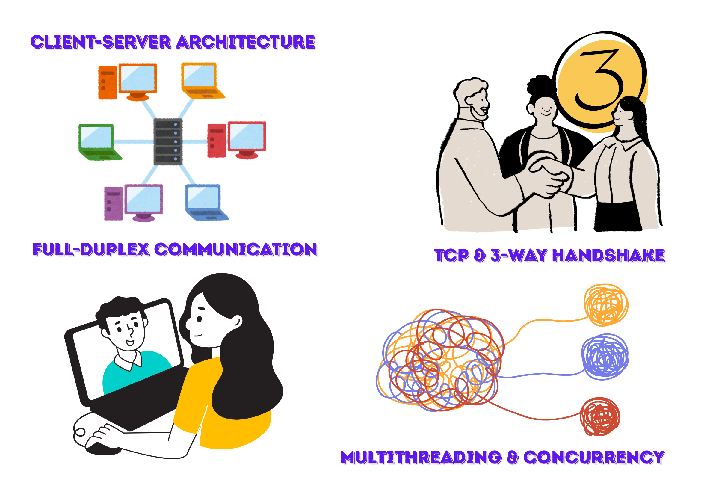
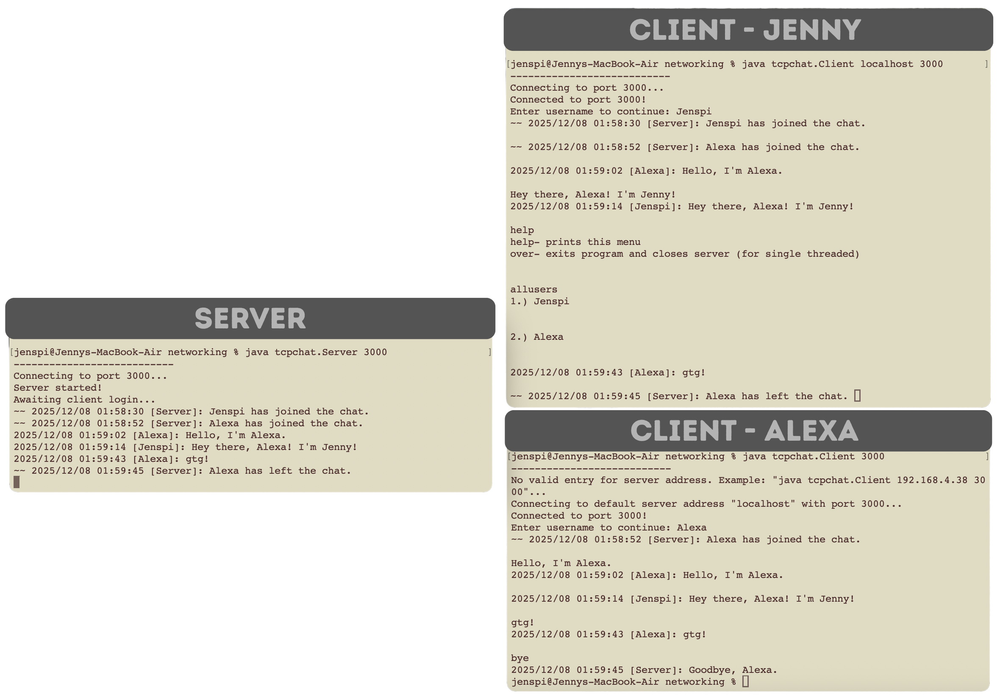

# TCPChat: Multi-Machine Chatroom

> Terminal-based TCP chat application with Client-Server Architecture and extensive error handling. Real-time communication between multiple clients works on single machine or with multiple machines on same home network.

<!--Project version, tech stack-->
<p align="center">
<a href="https://github.com/Jenspi/TCPChat/releases">
<br>


</p>

## 📋 Table of Contents
<a id="readme-toc"></a>
- [TCPChat: Multi-Machine Chatroom](#tcpchat-multi-machine-chatroom)
  - [📋 Table of Contents](#-table-of-contents)
  - [✨ Features](#-features)
    - [🏗️ Architecture: Client-Server Model](#️-architecture-client-server-model)
  - [🏗️ File Architecture](#️-file-architecture)
  - [🚀 Local development setup \& usage](#-local-development-setup--usage)
    - [📦 Requirements](#-requirements)
    - [🎮 Commands](#-commands)
  - [🎲 Chat Session Examples](#-chat-session-examples)
  - [📄 License](#-license)
    - [👤 Author](#-author)
  - [🔧 Technical Details](#-technical-details)

## ✨ Features

🎯 **Real-time messaging** between numerous connected clients in the terminal
<br>🎯 **Broadcast messaging** to *all* connected clients
<br>🎯 **Connection notifications** when users join or leave
<br>🎯 [**Client commands**](#-commands)
<br>🎯 **Extensive error handling** so it's nearly foolproof
<br>🎯 **Cross-platform** (Windows, macOS, and Linux)



<p align="right"><i><a href="#readme-toc">(back to table of contents)</i></a></p>

### 🏗️ Architecture: Client-Server Model

```
 CLIENT 1                    SERVER                    CLIENT 2
    |                          |                          |
    |-------- connect -------->|<------- connect ---------|
    |                          |                          |
    |------ send message ----->|                          |
    |                          |------ broadcast -------->|
    |<----- broadcast ---------|<----- send message ------|
    |                          |                          |
```

<p align="right"><i><a href="#readme-toc">(back to table of contents)</i></a></p>

## 🏗️ File Architecture

```
TCPChat/
├── tcpchat/                           # Java package containing source code
│   ├── Client.java                    # Client-side implementation
│   └── Server.java                    # Server-side implementation
├── docs/                              # Auto-generated Javadoc documentation
│   └── (Javadoc generated files)
├── images/                            # README assets (screenshots, diagrams)
├── LICENSE.txt                        # CC BY-NC-ND 4.0 license file
├── CITATION.cff                       # Citation metadata with ORCID reference
└── README.md
```
<p align="right"><i><a href="#readme-toc">(back to table of contents)</i></a></p>

## 🚀 Local development setup & usage

```bash
【 Clone or download the project 】
$ git clone https://github.com/Jenspi/TCPChat
$ cd tcpchat

【 Compilation 】
$ javac tcpchat/Server.java
$ javac tcpchat/Client.java

【 Server 】
# 3a. Start the Server on a custom port:
$ java tcpchat.Server 3000                         # 3000 = desired port

# 3b. Start the Server on the default port (5000): 
$ java tcpchat.Server
# Note: This port number may already be taken by other processes on the machine if the user already has something running with *Vite*, *Expo*, etc.

【 Client 】
# 4a. Connecting Clients on the same machine (localhost):
$ java tcpchat.Client localhost 3000               # 3000 = desired port

# 4b. Connecting Clients on different machines (use Server's IP address; see below):
$ java tcpchat.Client 192.168.1.100 3000           # 3000 = desired port

# 4c. Connecting Clients using defaults (localhost, port 5000):
$ java tcpchat.Client

【 Finding your IP address for connecting to a custom server address 】
# Finding Your SERVER IP Address onmacOS/Linux:
$ ifconfig | grep "inet " | grep -v 127.0.0.1

# Finding Your SERVER IP Address on Windows:
$ ipconfig
# Look for "IPv4 Address" under your active network adapter.

【 Javadoc Generation 】
$ javadoc -d docs -author -version Client.java Server.java
```

### 📦 Requirements

- [ ] Java JDK 8 or higher
- [ ] Network connectivity (same home network and/or accessible IP addresses)
- [ ] Available ports (default: 5000)

### 🎮 Commands

| Command     | Description                                      |
|-------------|--------------------------------------------------|
| `bye`       | Disconnect from the chat server gracefully       |
| `allusers`  | Display list of all currently connected users    |
| `help`      | Show available commands                          |

<p align="right"><i><a href="#readme-toc">(back to table of contents)</i></a></p>

## 🎲 Chat Session Examples

<p align="center" height=100% width=100%><p align="right"><i>TCPChat 1.0 Example A: Server with 2 Clients connected, both on same machine.</i></p></p>

<p align="center"> <p align="right"><i>TCPChat 1.0 Example B: Server with 2 Clients connected, one on different machine (hard to read, sorry).</i></p></p>

<p align="right"><i><a href="#readme-toc">(back to table of contents)</i></a></p>

## 📄 License

[![CC BY-NC-ND 4.0][cc-by-nc-nd-shield]][cc-by-nc-nd] <br>
*Updated December 7, 2025.*

This work is licensed under a
[Creative Commons Attribution-NonCommercial-NoDerivs 4.0 International License][cc-by-nc-nd].

### 👤 Author

<p align="center"><p align="center"><i>Jenny Spicer / Jennifer Spicer</i></p></p>

<p align="center">
<a href="https://jenspi.github.io/"></a>
<a href="https://www.linkedin.com/in/jenspi/"></a>
<a href="https://www.github.com/jenspi/"></a>
</p>

<p align="right"><i><a href="#readme-toc">(back to table of contents)</i></a></p>

## 🔧 Technical Details

<u>**🧵 Concurrency & Multithreading**</u>
<br>✅ **Multithreaded Server**: Thread-per-client model - dedicated `ServerHandler` thread spawned for each connection
<br>✅ **Concurrent Message Handling**: Multiple clients send/receive messages simultaneously without blocking
<br>✅ **Asynchronous I/O**: Separate threads for reading and writing enable full-duplex communication
<br>✅ **Thread Lifecycle Management**: Threads created on connection, gracefully terminated on disconnect
<br>✅ **Thread-Safe Collections**: Uses `HashMap` for client storage (consider `ConcurrentHashMap` for production)

<u>**🛜 Networking**</u>
<br>✅ **TCP/IP Socket Programming**: Connection-oriented protocol with automatic 3-way handshake (handled by Java Socket API)
<br>✅ **Client-Server Architecture**: Centralized server coordinates all client communication
<br>✅ **Full-Duplex Communication**: Simultaneous bidirectional data flow between server and clients
<br>✅ **Persistent Connections**: Sockets remain open until client sends "bye" command

<u>**🗃️ Data Structures**</u>
<br>✅ **HashMap Storage**: `HashMap<String, Socket>` maps username → client socket for O(1) lookup
<br>✅ **Output Stream Cache**: `HashMap<String, DataOutputStream>` maps username → output stream for efficient broadcasting and prevents the need to recreate threads
<br>⚠️ **Thread Safety Note**: Should upgrade to `ConcurrentHashMap` instead of `HashMap` for thread-safe client storage
  
<u>**📣 I/O Streams**</u>
<br>🗣️ Client → Server: DataOutputStream → DataInputStream
<br>📢 Server → Client: DataOutputStream (broadcast to all)
<br>🗣️ User Input: BufferedReader reading from System.in
  
<u>**💬 Message Format**</u>
<br>`YYYY/MM/DD HH:MM:SS [Username]: Message content`

**💬 Example:**
<br>`2025/12/08 15:30:45 [Batman27]: Hello.`

<p align="right"><i><a href="#readme-toc">(back to table of contents)</i></a></p>

<!-- 📚 Possible Enhancements
 Make whole project a jar for easier distribution
 Implement thread pools instead of thread-per-client for better scalability
 Use ConcurrentHashMap for thread-safe client storage
 Add private messaging between users
 Implement client-side message history
 Add authentication/password protection
 GUI interface using JavaFX or Swing
 Message encryption for security
 Persistent storage with database
 Graceful server shutdown handling
 Be able to connect from anywhere in the world / persistent server running
 UNIQUE username system -->

---

> [!CAUTION]
> This is a learning project demonstrating TCP socket programming, multithreading, and client-server architecture in Java. It is not production-ready and lacks security features required for real-world applications.


<!-- Variables -->
[cc-by-nc-nd]: http://creativecommons.org/licenses/by-nc-nd/4.0/
[cc-by-nc-nd-image]: https://licensebuttons.net/l/by-nc-nd/4.0/88x31.png
[cc-by-nc-nd-shield]: https://img.shields.io/badge/License-CC%20BY--NC--ND%204.0-lightgrey.svg?style=for-the-badge&